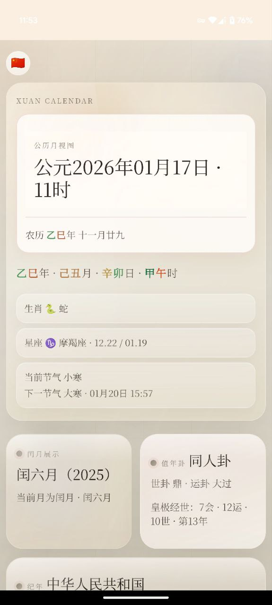
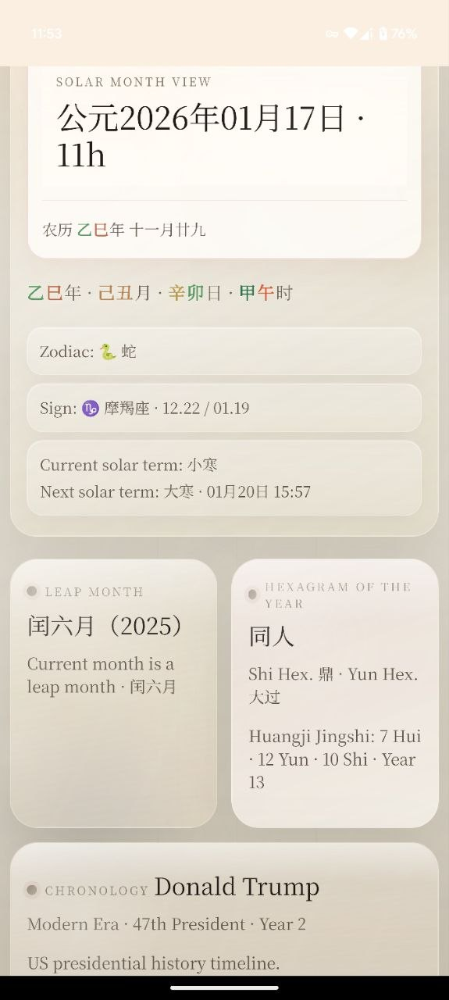
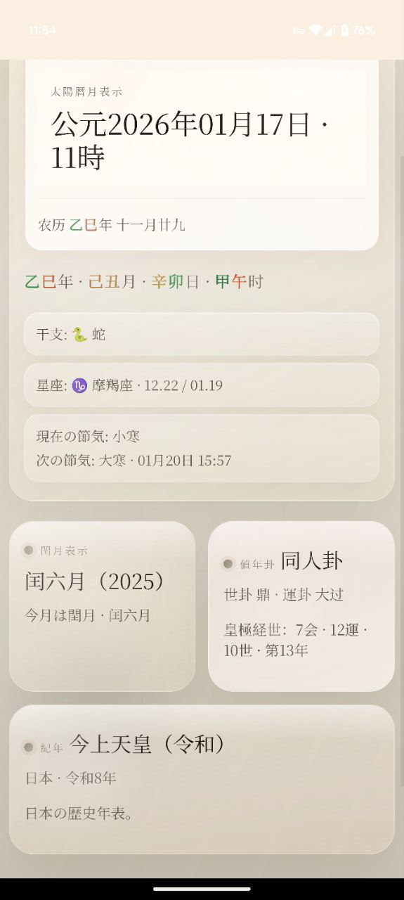
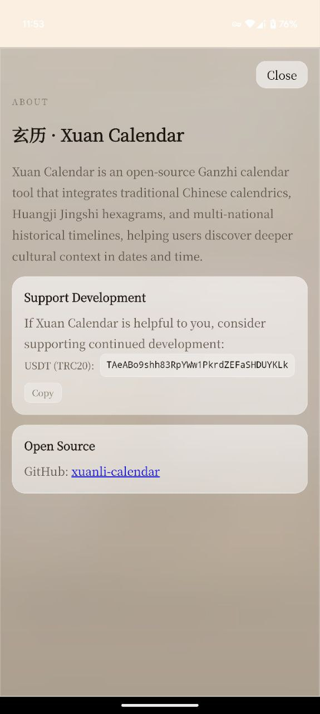

# 玄历 · Xuan Calendar

**240KB. No ads. No subscription. No tracking.**

市面上的日历 App 动辄几十上百 MB，塞满广告、付费墙和后台常驻。玄历不一样——整个 APK 仅 **240KB**，无广告、无内购、无网络依赖、无后台进程，装上即用，完全开源。

Most calendar apps are bloated with ads, paywalls, and background services. Xuan Calendar is different — the entire APK is only **240KB**, with zero ads, zero in-app purchases, zero network dependency, and zero background processes. Install and use. Fully open source.

---

一款开源的干支历法工具，融合中国传统历法、皇极经世卦象与多国历史纪年。

An open-source Ganzhi (Heavenly Stems & Earthly Branches) calendar app that combines traditional Chinese calendrics with multi-national historical timelines.

## Screenshots

<p>
  
  
  
  
</p>

## Why Xuan Calendar?

| | Other Calendar Apps | Xuan Calendar |
|---|---|---|
| Size | 50–200 MB | **240 KB** |
| Ads | Everywhere | **None** |
| Subscription | Required for basics | **Free forever** |
| Network | Required | **Fully offline** |
| Background | Always running | **Zero** |
| Privacy | Tracks everything | **No data collected** |
| Source | Closed | **Open source** |

## Features

- **Ganzhi Four Pillars** (四柱) — Year, month, day, hour pillars based on Lichun and Jieqi
- **Lunar Calendar** (农历) — Powered by browser `Intl` API with leap month detection
- **24 Solar Terms** (节气) — Current and next term display
- **Yearly Hexagram** (值年卦) — Based on Huangji Jingshi cycle, with full I Ching text (卦辞/彖辞/象辞)
- **Chinese Zodiac & Western Astrology** — Zodiac by Lichun, constellation by date
- **Multi-National History** — China (秦–present), USA (1789–present), UK (1066–present), Japan (794–present)
- **Trilingual UI** — Chinese 中文 / English / 日本語, switchable independently from country
- **Swipe Navigation** — Swipe left/right to change days
- **Leap Month Display** — Shows only the leap month when present
- **Disclaimer & About** — Built-in legal disclaimer, donation info, open-source link

## Supported Countries & History

| Country | Period | Content |
|---------|--------|---------|
| 🇨🇳 China | 221 BCE – present | Emperors, dynasties, era names |
| 🇺🇸 USA | 1789 – present | All 47 presidents, political eras |
| 🇬🇧 UK | 1066 – present | All monarchs, royal houses |
| 🇯🇵 Japan | 794 – present | Emperors, shoguns, modern era |

## Run Locally

```bash
python3 -m http.server 8000
# Open http://localhost:8000
```

## Build Android APK

```bash
cd android
ANDROID_HOME=/path/to/android-sdk gradle assembleRelease
```

The signed APK will be copied to the project root as `xuanli-v{version}-release-signed.apk`.

To build with your own signing key, create `keystore.properties` in the project root:

```properties
storeFile=your-keystore.jks
storePassword=your-password
keyAlias=your-alias
keyPassword=your-password
```

## Project Structure

```
index.html              — Page structure
styles.css              — UI styles with Five Elements themes
calendar-core.js        — Calendar engine (Ganzhi, lunar, solar terms, hexagram, reign)
app.js                  — Rendering, i18n integration, interaction
i18n.js                 — Trilingual UI translations
hexagram-originals.js   — I Ching original texts (卦辞/彖辞/象辞)
hexagram-i18n.js        — Hexagram translations (EN/JA)
history-us.js           — US presidential history
history-uk.js           — UK monarchical history
history-jp.js           — Japanese imperial/shogunate history
history-i18n.js         — Cross-language history translations
android/                — Android WebView wrapper
```

## Calendar Rules

- **Year Pillar**: switches at Lichun (立春)
- **Month Pillar**: switches at Jieqi (节气)
- **Day/Hour Pillar**: switches at 23:00 (子初)
- **Lunar Calendar**: via browser `Intl.DateTimeFormat` with Chinese lunar calendar
- **Yearly Hexagram**: Huangji Jingshi (皇极经世) cycle of Hui/Yun/Shi/Year
- **Reign Periods**: follows the Central Plains main line for Chinese history

## Donate

If Xuan Calendar is useful to you, consider supporting development:

**USDT (TRC20):** `TAeABo9shh83RpYWw1PkrdZEFaSHDUYKLk`

## License

Open source. See the app's built-in disclaimer for usage terms.
